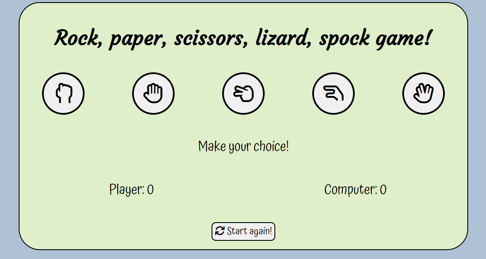
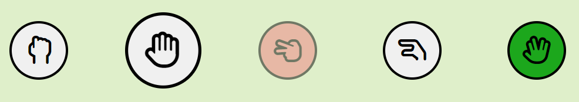
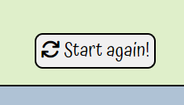
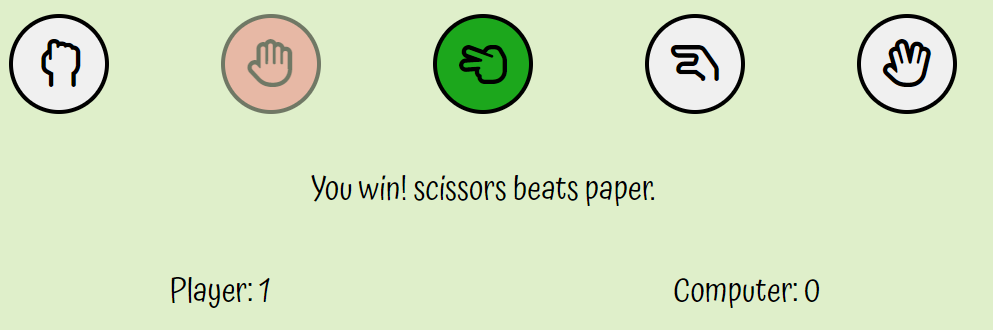
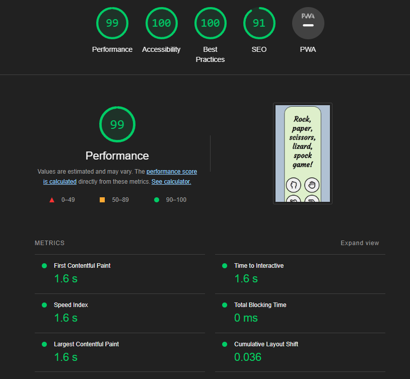
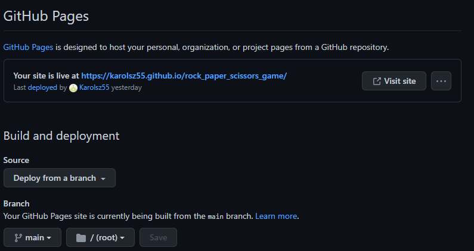

# Game of rock, paper, scissors, lizard, spock!

Rock, Paper, Scissors, Lizard, Spock! is a variation of a traditional game of chance. The game "Rock Paper Scissors Lizard Spock" was invented by a software engineer named Sam Kass. 
Sam outlined the rules and hand gestures on his website in 1998. He, however, called it "Rock Paper Scissors Spock Lizard". 

My variation is an in browser version of the game written using HTML, CSS and JavaScript, available for use on desktop, tablet and mobile devices. 
It provides a quick dose of entertainment, is lightweight, fun and easy to understand. Player gets to take a chance against computer in a match up to 5 points.

## Features
*** 
- Navigation
    * The game has a very simple and straightforward layout.
    * Its a single page website.
    * Game area can be divided into title, selection icons below, round result below that, then the scoreboard for player and computer and finally, a start-again button that re-sets the game.
***

- Buttons
    * There are several functioning buttons in the game. 5 main buttons are responsible for player choices.
    * They are interacting on mouse hover using a transition animation to increase their size.
    * Selection buttons also interact with the game depending on player/computer choices highlighting a winner/loser outcome.
    * An additional button is located at the bottom center of the game area and is responsible for starting the game over. It resets the scoreboard and removes selection highlights.
***

- Scoreboard & Results
    * This section of the game window is responsible for displaying current player/computer score to the maximum of 5, after which it displays a "game over" alert in browser.
    * The results is a text prompt that displays the results of the current selection.
***

## Testing

- I tested the game in 3 major browsers, Chrome, Edge and Firefox, as well as across multiple Android devices like smartphones and tablets.
- I also tested the game on iOS using Apple iPhone SE and iPhone 13 Pro Max.
- I confirmed that all game functionalities work as intended and bowser tab icon is displayed properly.
- I checked that everything is easily readable and contrast is satisfactory.
- I tested that game logic is working as intended; all buttons work properly and reset button starts the game over.
- I tested that game scales well into mobile and tablet devices.

## Bug fixing

- There were no post deployment bugs identified.
5

## Validating the code

- HTML
    * No errors were returned when passing through official W3C validator.

- CSS 
    * No errors were returned when passing through official W3C validator.

- JavaScript 
    * No errors were returned when passing through JSHint code analysis tool.

- Accessibility 
    * I confirmed that fonts and colors used are easily readible by running Lighthouse utility in devtools.
***

## Deployment

- I deployed the page using the free GitHub utility GitHub Pages.
- Page deployed succesfuly and without errors, deployed page was tested on multiple devices and operating systems by sharing the web address.
***

## Credits

- Content
    * Inspiration for the game layout and some of the JS game logic came form: https://github.com/WebDevSimplified/Rock-Paper-Scissors-In-JavaScript & https://github.com/kubowania/rock-paper-scissors-x3

- Design 
    * Selection button icons were sourced using: https://fontawesome.com/ 
    * Fonts used in creation of the game were sourced using: https://fonts.google.com/
    * Color scheme was created using: https://coolors.co/